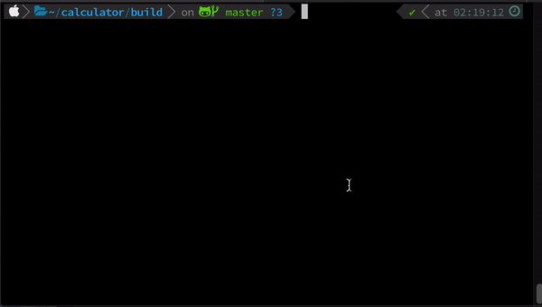
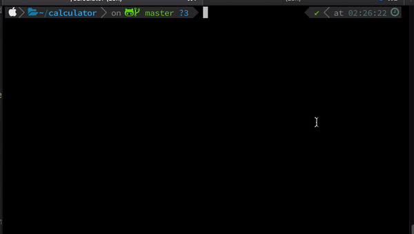
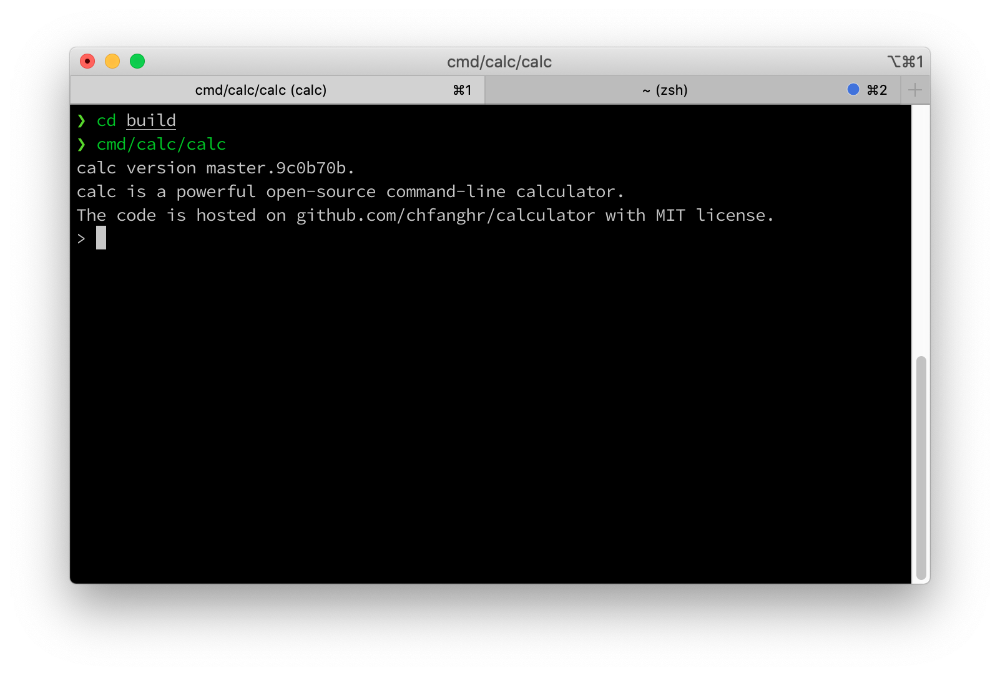

# Calculator [](https://circleci.com/gh/chfanghr/calculator)
`calculator` is a **Zero Dependency** **C++17** library. Frankly, the purpose of this library is to evaluate any common math expression 
with high speed and low memory cost. 
To achieve this, I implemented an engine which compiles math expressions 
to **VM bytecode** so that the expressions can be evaluated in VM effectively. <br>

Note That although this library is written in cpp, it provides **untested** C-APIs. Just have a try :P.

## Features: Support standard functions, operators, and constants
`calculator` supports all the standard stuff, and I'm definitely adding more later (also feel free to fork and add
 your own!) .
 
 ### Operators
 `+`, `-`, `*`, `/`, `^`, `%`
 
 ### Functions
 `sin`, `cos`, `tan`, `cot`, `sec`, `csc`, `asin`, `acos`, `atan`, `acot`, `asec`, `acsc`, `sqrt`, `log`, `lg`, `ln`, `abs`
 
 ### Constants
 `e`, `pi`
 
 ### History
 Previous results can be accessed with the `@` symbol. A single `@` returns the result of the last computation, while
  multiple `@` gets the n<sup>th</sup> last result, where n is the number of `@`s used (for example, `@@` returns the
   second-last result, `@@@@@` returns the fifth-last result).
 
## Requirements
This library requires **C++17** to build, including compiler and standard library support. <br>
So the following minimum versions will be required to build the library:
* GCC 7
* Clang 5
* GCC 8 in cygwin
* VS 2017 15.3 (technically, I don't know )

...And the `cmake` and `make` tools:
* cmake 3.1.0
* make 4.0.0

If you want to build tests(which is enable by default), you should also install Google Test framework on your machine.
 
## Build
First of all, clone the project with
```shell script
git clone --recursive https://github.com/chfanghr/calculator.git
cd calculator
scripts/get_cpp_linenoise_and_apply_patch.sh
```
Then build it:
```bash
cmake -H. -Bbuild
cmake --build build
```
This will create a `build` folder in the project root, and build the project inside it.

If you don't want to build tests, replace the first command with:
```bash
cmake -DBUILD_TESTING=OFF -H. -Bbuild
``` 

### Build for Windows
```shell script
scripts/win32_build.sh
```
Note that the tests are disabled on Windows.

## Tests
The tests will be built by default. To run it(for now there is only one test, more tests will be added soon ):
```bash
cd build
make test
## or
tests/*tests
```
You'll see:<br>


## Examples
The examples will be built by default, you will see them in your build folder.<br>
Execute the [`simple`](examples/simple/simple.cc) example as below:

```bash
cd build
examples/simple
examples/version
``` 
You'll see<br>


## CLI App: `calc`
**Usable but still Experimental**, check out [calc](cmd/calc/README.md)<br>


## API Document
Check [doc/APIs.md](doc/APIs.md)

## TODO
- [ ] More Uint Tests
- [ ] API Document
- [ ] More Examples
- [x] Full Fill README
- [x] CLI Application (Working in progress, check out [calc](cmd/calc))
- [ ] Benchmark

## Note: When you failed to build....
* Check if your compiler/tools meet the requirements.
* If you're on Windows.... Sorry, I cannot help you cause I have no machine running Windows...
* It's tested that this project can be built and run on Windows in cygwin.
* Any way, feel free to open an issue, but please post the full detail%)....

## Nightly Build
* For [Linux](https://circleci.com/api/v1.1/project/github/chfanghr/calculator/latest/artifacts/0//root/project
/linux_release.zip)<br>
* For [Windows]([linux_release.zip](https://circleci.com/api/v1.1/project/github/chfanghr/calculator/latest/artifacts/0
//root/project/windows_release.zip))

## LICENSE
MIT, check [LICENSE](LICENSE) for more details.
