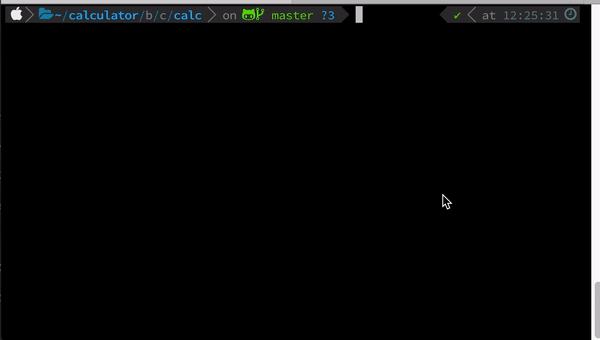
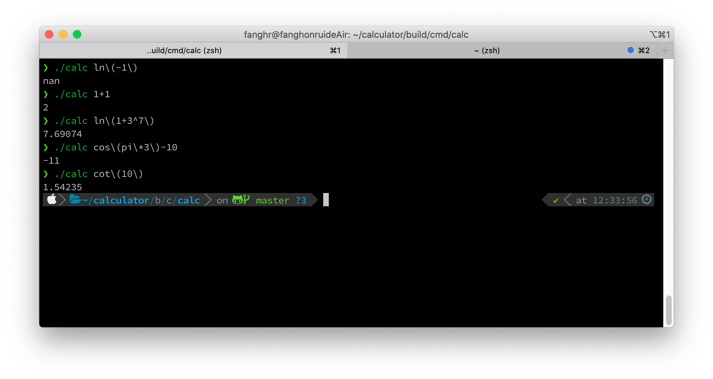
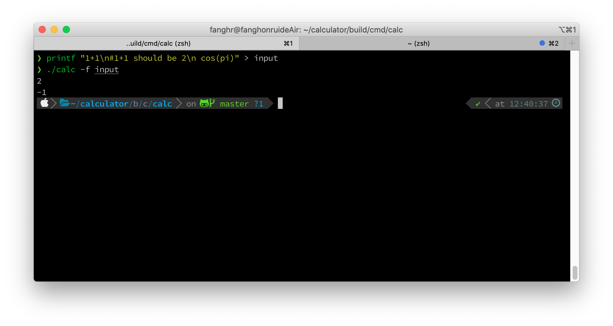

# calc

A simple, fast, and intuitive command-line calculator written in cpp. 

## Requirements
* Of course, `make`, `cmake`, cpp17 compiler,etc...
* The GNU's `libreadline`
    * If you're using osx - Then you need to do nothing. Just build it and enjoy!
    * If you're using ubuntu(or other debian based system) - If you're facing compilation issue, try to run this
     command in your terminal: `sudo apt install -y libreadline-dev` then have another shot. 
     * If you are on Windows .... Oh, Sorry. You have to find yourself a solution cause the developer have no machine
      running Windows :D. (Remember that the libreadline is needed to build calc)
     
## Usage
You can use calc in three ways: shell mode ,expression mode and file mode.

### Shell Mode
This is probably the mode you'll want to use. It's like the python shell or irb. **THIS MODE COMES WITH
AUTO-COMPLETION (Just press `TAB`)**  

### Expression Mode
You can also use calc to evaluate an expression with just a single command (i.e. without opening the shell). To do this, just use `calc [expression]`:

### File Mode
`calc` will evaluate expressions store in the files. Each line in the file will be considered as an expression
, unless the line is begin with `#`.  
An explicit `-f` option will be required to enable this mode:

## Why not use .....
* Google
    * Doesn't work without an internet connection
    * Slower
    * Doesn't show previous computations, so you end up with multiple tabs open at once.
* Spotlight (on OS X) (Yes I got a mac and I finished this project on it...)
    * No history
    * Switching between Spotlight and other windows isn't too fun
* Python/IRB
    * Requires use of a separate math module for most functions and constants 
    * A little bit slower to start up
* `bc`
    * Limited number of built-in functions; these have shortened (not too intuitive) names as well.

~~The most important reason is that I'm quite familiar with compiler and I  want to show off :P~~ 

The alternatives above are all great, and have their own advantages over calc. I highly recommend looking into these
 if you don't like how calc works.
